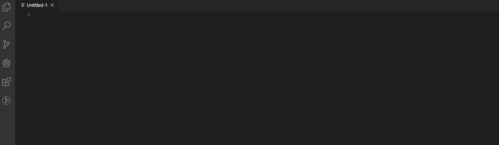

# VS Code LS-DYNA extension

## Integrates [LS-DYNA](https://www.lstc.com/) into VS Code.

This extension integrates LS-DYNA formatting and keyword snippets into VS Code. 

### Example

### Contributing new Keywords

There are a few ways you can go about adding keywords or features:

1. Send me an email or message on Github with the desired keyword (and an example).
2. Make a pull request:  
    1. Create a fork of the master.
    2. Add your new keyword(s) under the `keywords/` directory.
    3. Run the `processing.ipynb` script to process the keywords into VSCode snippet format.
    4. Create a new pull request to merge your branch into this master. 
    5. After the pull request is accepted 

### Some References. 

[vim-lsdyna](https://github.com/gradzikb/vim-lsdyna)  
[DCHartlen's vscode extension](https://github.com/DCHartlen/LSDynaForVSCode)